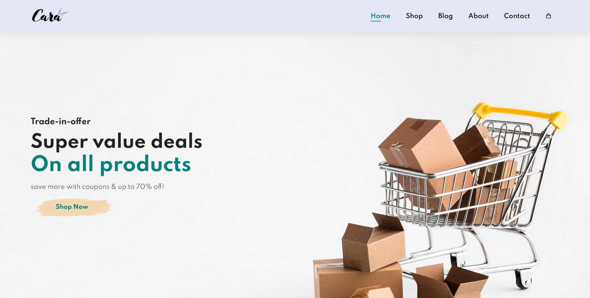
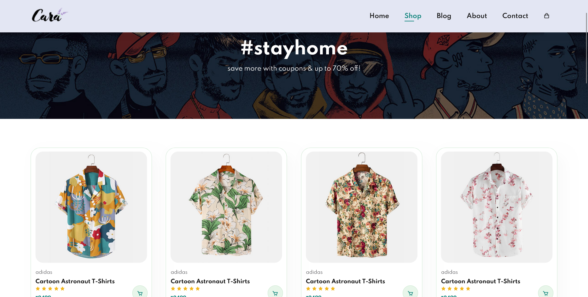
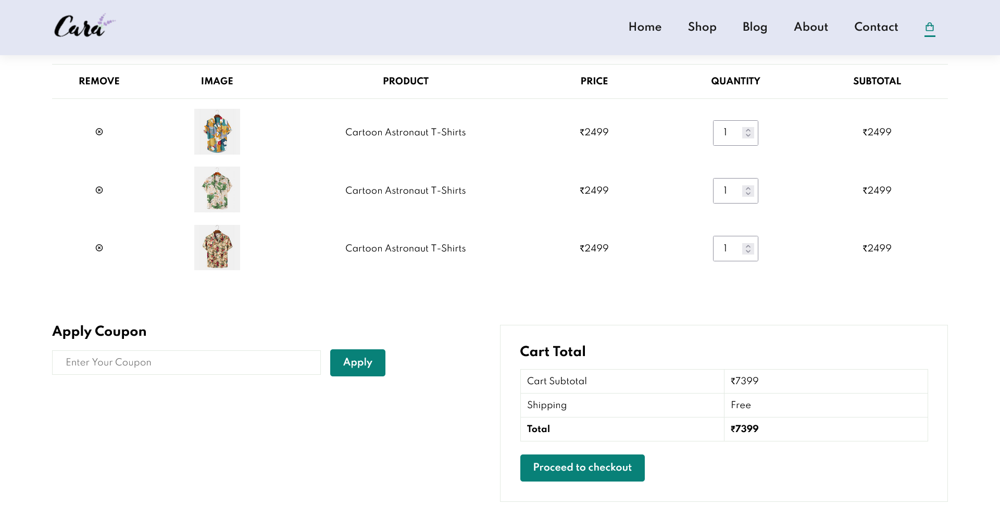

# Ecommerce Website With HTML CSS JavaScript

<div align = "center">
    
</div>

<h3 align="center"><b>E-commerce Website</b></h3>

<p align="center">
    <a href="https://sahadcmd.github.io/Ecommerce-Website/" target="_blank">Visit Website</a>
    ·
    <a href="https://github.com/sahadcmd/Ecommerce-Website/issues" target="_blank">Report Bug</a>
    ·
    <a href="https://github.com/sahadcmd/Ecommerce-Website/issues" target="_blank">Request Feature</a>
</p>

## About this project 🚀

This is a responsive E-commerce website using HTML, CSS, and JavaScript. The website seamlessly adapts to different screen sizes, providing an optimal user experience. This project allowed me to showcase my skills in front-end web development and create a visually appealing and user-friendly online shopping platform.

## Technologies 🛠️

* `HTML`
* `CSS`
* `JavaScript`
* `Bootstrap`
* `jQuery`

## How it looks 📷

<div align="center">
    
</div>

<br>
<br>

<div align="center">
    
</div>
<br>
<br>

<div align="center">
    
</div>
<br>

<br>
<br>

<div align="center">
  
</div>

<br>
<hr>
<h5 align="center">Connect with me!</h5>

  <p align="center">
    <a href="https://www.linkedin.com/in/sahadmahaboobp" target="_blank">LinkedIn</a>
  </p>

## Backend Logic
1. Adding/deleting items from Admin page
2. Reflecting admin page product changes on website
3. Adding items dynamically to cart

### Running the website:
1. Go to the `admin/` directory, then run the _receiver_ file for the `products_index.json` which contains the index of items added from the admin page. This file handles all the `PUT` and `GET`requests involving the dynamically added items.
  ```bash
  node receiver.js
  ```
  
2. Now, run the main page and the admin page as required.